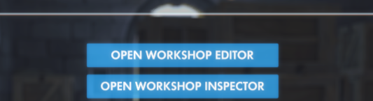
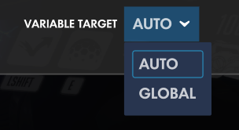
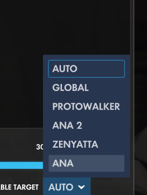
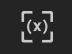

# OWDataExtractor
Workshop tool for recording tournaments and exporting them as data

## Import code: F4M6WT

-------

### SPECIAL THANKS TO ZEZOMBYE FOR [OVERPY](https://github.com/Zezombye/overpy)  
I use overpy's decompiler to extract the data. Without it this project would have been a *huge* pain in the ass.

-------

# HOW TO USE IT

1. As the round is ending, go into the workshop inspector.  
  

2. Wait for this list to fill up with the names of all the players:  
Bad:  
  
Good:  
  

3. Click on the button labeled `(x)`  


4. Go to [the website](https://protowalker.github.io/OWDataExtractor) and paste into the box labeled "Input data from Overwatch.."

The data will be parsed into nice JSON for you to read down below.

-------------

# HOW IT WORKS


EVENTS: One array deep is the round. The next array deep is chunks of 50 events  
There are 5 arrays inside of each chunk; each array is 50 long  
The first array is timestamps; second is type (an enum, next post will have that), 3rd is the name of the attacker/healer, 4th is the name of the victim/healee, 5th is the associated value (the damage amount, the healing amount, or the direction of knockback)  
For the type, 0 = Damage, 1 = Healing, 2 = Final Blow, 3 = Knockback 

--------

DATA: One array deep is the round. Two arrays is the player. Next is chunks of 50 pieces of data  
Each chunk is made up of 50 elements, each one representing a single timestamp  
0: MatchTime() + Millis,  
1: EP_Alive,  
2: EP_Position,  
3: EP_Direction,  
4: EP_Health,  
5: EP_Velocity,  
6: abilityFlags   
EP = Event Player. Pretty self-explanatory. Ability Flags is special  
```cs
enum Ability {  
    Ability1 = 1,
    Ability2 = 2,
    PrimaryFire = 4,
    SecondaryFire = 8,
    Melee = 16,
    Ultimate = 32
}
```
It's equal to what abilities are active during that tick. Data is taken for all players at a 5 second interval but if I can I'm going to up it to 1 second.
